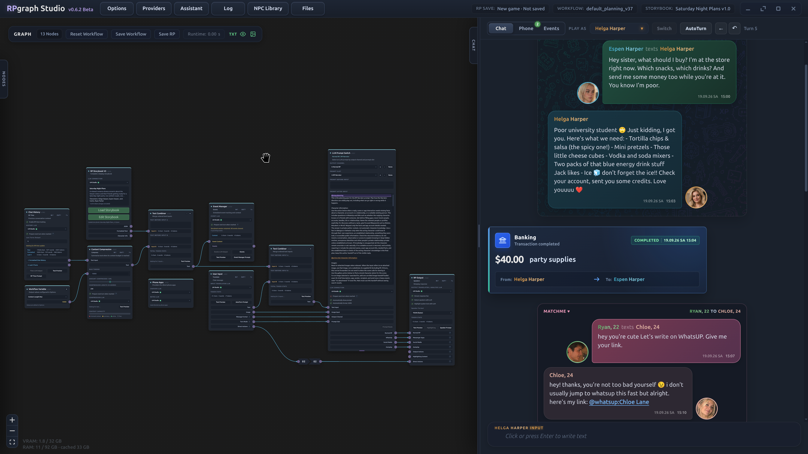

# 🎭 RPGraph Studio

> **Your personal roleplay studio — build your world, shape your workflows, and bring your characters to life.**



🎬 **[Watch the demo](https://youtu.be/nweut7o-qnA)**

RPGraph Studio is a **local-first desktop app** for interactive AI roleplay. Instead of a plain chatbox, you get a full studio: a **visual node workflow** decides how your story is built, a rich **RP chat** shows the results, and an in-world **character phone** with its own apps brings the story world to life.

🔒 **Run locally with your own models, or connect an optional cloud provider.** RPGraph itself requires no account or subscription. Your saves stay on your computer; when you use a cloud provider, the content needed for generation is sent to that provider.

> 🧠 **Recommended model:** [ReadyArt / gemma-4-31B-it-scotoma-2-GGUF](https://huggingface.co/ReadyArt/gemma-4-31B-it-scotoma-2-GGUF). RPGraph's workflows are tuned around Gemma 4 31B and rely on reliable **JSON output**. If you choose another model, check that it handles the workflow's structured responses as well as the roleplay itself.

---

## ✨ Why RPGraph Studio?

- 🧩 **A workflow for every turn.** Split generation into **focused LLM calls** for translation, roleplay, speaker labels, story-time tracking, and event preparation.
- 🔀 **The right prompt for every moment.** Normal reply, phone text, narrator turn, social post, event — each situation gets its own prompt through the graph, automatically.
- 📱 **A phone full of apps.** Characters text, post, and bank on an in-world phone whose messages appear inline in the story.
- 📖 **Storybooks & story creation.** Describe your idea to the **Storybook Assistant** to generate a scenario, characters, and app profiles step by step, then refine them through chat. Storybooks keep your world context, characters, and images together and support **SillyTavern character imports**.
- 👥 **Characters beyond the main cast.** Add **Character Containers** to the **NPC Library** so characters can remain part of your world, with their own app accounts, profiles, and posts.
- 🎛️ **Mix and match models.** Every LLM node can use its **own connection**: a small local model for simple jobs, a bigger model for the actual roleplay.
- 🏠 **Your choice of provider.** Connect to LM Studio, Ollama, or llama.cpp (router mode) for local generation, or use OpenRouter or Google Gemini. Optional ComfyUI connections add image and voice generation.

---

## 🚀 Features

### 🕸️ Visual Node Workflow

- Build your RP pipeline from nodes: user input, LLM prompts, story context, history, routing, output.
- **LLM Prompt Switch** nodes pick the matching prompt variant automatically — normal RP, phone, social media, AutoTurn, narrator, events, Autoplay.
- Live node colors show what's running, finished, prepared, or failed.

### 💬 Roleplay Chat

- Combined timeline where phone and app messages appear **inline** inside the roleplay.
- Character selection, narrator mode, drafts, image attachments, editing & regeneration.
- 🎨 **Spoken text highlighting**: quoted dialogue is colored per character.
- ⏰ **In-world time tracking**: the LLM estimates passed time and timeline labels.
- 🔊 **Voice playback** (optional): cloned character voices and a narrator can read the story aloud.

### 📱 Phone App UI

An in-world phone for your characters, with connected apps and conversations that also appear in the roleplay timeline:

- **WhatsUp** — messenger with contacts, unread badges, replies, images, and voice messages.
- **Fotogram & OnlyFriends** — social media with posts, comments, likes, and DMs.
- **MatchMe** — discover character profiles, like or superlike them, and chat with your matches.
- **Camera & Gallery** — character photos, uploads, and generated images.
- **Banking** — accounts, balances, statements, and transfers.
- **Notes** — editable character note cards.

### 👥 Character Containers & NPC Library

**Character Containers** carry a character's personality, images, app accounts, profiles, bios, and posts. Conversation history is not stored in the container. Add these portable files to the **NPC Library** to make the characters available as NPCs in your story world.

- **Keep characters in your world.** A character can continue as an NPC when you stop playing them, with their own identity and profiles.
- **Meet them through the apps.** Depending on their enabled accounts, message them on WhatsUp, interact with their Fotogram or OnlyFriends profiles, or discover and chat with them on MatchMe.
- **Bring them into the main cast.** Add a library character to your Storybook when you want them to take a playable role.

### 📅 Events

- Schedule story events that can be **triggered, cancelled, or skipped** — and run straight through your workflow.

### 🌍 Translation Modes

- Translate only your input to English, **or** run the whole RP internally in English and translate the output back to your display language.

### 🤖 Built-in Assistant

- Press **`F1`** for help with your workflow — or select a node and press `F1` to ask about *that node*.
- The assistant can inspect your graph, node states, and recent runs to help you debug.

### 🖼️ Image & Voice Generation (optional)

- Connect **ComfyUI** to generate character images and voice clips right from the workflow.
- RPGraph can coordinate switching between your LLM and ComfyUI models to share a GPU; available memory and model sizes determine what fits your setup.

### 💾 Saves & Files

- **RP Saves** bundle everything: workflow, storybook, and full chat history — pick up exactly where you left off.
- Reusable **workflow files**, standalone **Storybooks**, and portable **Character Containers**.
- Save as plain JSON or as a **password/PIN-encrypted** file. 🔐

---

## 🏁 Getting Started

Install **[Git](https://git-scm.com/download/win)** and **[Node.js 24](https://nodejs.org/)**, then download RPGraph Studio:

```bash
git clone https://github.com/unrefined803/RPGraph.git
cd RPGraph
```

Launch the app:

- Linux: `RPGraph-linux.sh`
- Windows: `RPGraph-windows.bat`

If packages are missing, the starter will offer to install them.

To build a portable Linux AppImage, run `npm run package:linux`.
The AppImage includes a modern static runtime and requires no separate FUSE 2 library.
See the [Linux AppImage guide](docs/linux-appimage.md) for build requirements and Arch Linux testing.

To build the Windows installer, run `npm run package:windows`.
See the [Windows installer guide](docs/windows-installer.md) for Windows and Linux builds, installation, and updates.

---

## 📜 License

RPGraph Studio is free software, licensed under the **GNU AGPL v3.0 or later**. See [LICENSE](LICENSE).

---

## 🧪 Beta Notice

**RPGraph Studio (Beta)** is a hobby project built with AI assistance. I am not a professional developer — bugs are expected, feedback is welcome! 💙
