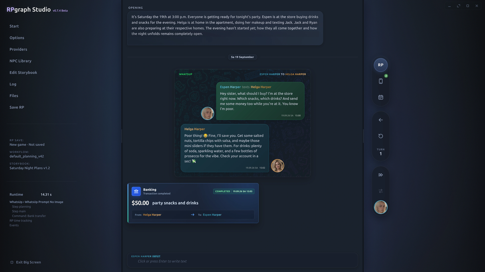

<div align="center">

# 🎭 RPGraph Studio

**Your personal roleplay studio.**<br>
Build your world, shape your workflows, and bring your characters to life.

[**⬇️ Download**](https://github.com/unrefined803/RPGraph/releases/latest) · [**▶️ Watch the demo**](https://youtu.be/nweut7o-qnA) · [**🚀 Getting started**](#-getting-started)

[](docs/rpgraph-ui-preview.webp?raw=true)

</div>

RPGraph Studio is a **local-first desktop app** for interactive AI roleplay. Instead of a plain chatbox, you get a full studio: a **visual node workflow** decides how your story is built, a rich **RP chat** shows the results, and an in-world **character phone** with its own apps brings the story world to life.

> 🔒 **Run locally with your own models, or connect an optional cloud provider.** RPGraph itself requires no account or subscription. Your saves stay on your computer; when you use a cloud provider, the content needed for generation is sent to that provider.

> 🧠 **Recommended model:** [ReadyArt / gemma-4-31B-it-scotoma-2-GGUF](https://huggingface.co/ReadyArt/gemma-4-31B-it-scotoma-2-GGUF). The default workflows are tuned for Gemma 4 31B and already push it to its limits, so smaller or weaker models will likely struggle. Any model you choose must return reliable **JSON output**.

---

## ✨ Features

### 🕸️ Visual Node Workflow

- Build your RP pipeline from nodes and split each turn into **focused LLM calls**: translation, roleplay, speaker labels, story time, events.
- **LLM Prompt Switch** nodes pick the matching prompt automatically: normal RP, phone, social media, narrator, events, Autoplay.
- Live node colors show what's running, finished, prepared, or failed.

### 🔌 Models & Providers

- Use LM Studio, Ollama, or llama.cpp (router mode) locally, or OpenRouter and Google Gemini in the cloud.
- Every LLM node can use its **own connection**: a small model for simple jobs, a bigger one for the roleplay.

### 💬 Roleplay Chat

- One timeline where phone and app messages appear **inline** inside the roleplay.
- Narrator mode, drafts, image attachments, editing & regeneration.
- Per-character dialogue colors, in-world time tracking, and optional voice playback.

### 📱 Character Phone

An in-world phone whose conversations also appear in the roleplay timeline:

| App | What it does |
| --- | --- |
| 💬 **WhatsUp** | Messenger with contacts, replies, images, and voice messages. |
| 📸 **Fotogram & OnlyFriends** | Social media with posts, comments, likes, and DMs. |
| 💘 **MatchMe** | Discover profiles, like or superlike them, and chat with matches. |
| 🖼️ **Camera & Gallery** | Character photos, uploads, and generated images. |
| 🏦 **Banking** · 📝 **Notes** | Accounts and transfers; editable character note cards. |

### 📖 Storybooks & Characters

- Describe your idea to the **Storybook Assistant** to generate a scenario, characters, and app profiles, then refine them through chat. **SillyTavern character imports** are supported.
- **Character Containers** are portable files with a character's personality, images, app accounts, profiles, and posts.
- Add them to the **NPC Library** to keep characters in your world and meet them through the apps, or bring them into the main cast.

### 🧰 Story Tools

- **Events:** schedule story events that can be triggered, cancelled, or skipped.
- **Translation:** translate only your input, or run the RP in English and translate the output back.
- **Assistant:** press **`F1`** for help with your workflow or a selected node; it can inspect your graph and recent runs.
- **Images & voice** (optional): connect **ComfyUI** for character images and voice clips, sharing one GPU with your LLM.

### 💾 Saves & Files

- **RP Saves** bundle workflow, Storybook, and full chat history, so you pick up exactly where you left off.
- Save as plain JSON or as a **password/PIN-encrypted** file.

---

## 🚀 Getting Started

### ⬇️ Install

**[Download the latest release](https://github.com/unrefined803/RPGraph/releases/latest)** and install it. Windows and Linux are supported.

### 🛠️ For developers

Install **[Git](https://git-scm.com/downloads)** and **[Node.js 24](https://nodejs.org/)**, then clone the repository:

```bash
git clone https://github.com/unrefined803/RPGraph.git
cd RPGraph
```

Launch the app with `RPGraph-linux.sh` or `RPGraph-windows.bat`. If packages are missing, the starter will offer to install them.

---

## 📜 License

RPGraph Studio is free software, licensed under the **GNU AGPL v3.0 or later**. See [LICENSE](LICENSE).

## 🧪 Beta Notice

**RPGraph Studio (Beta)** is a hobby project built with AI assistance. I am not a professional developer, so bugs are expected. Feedback is welcome! 💙
